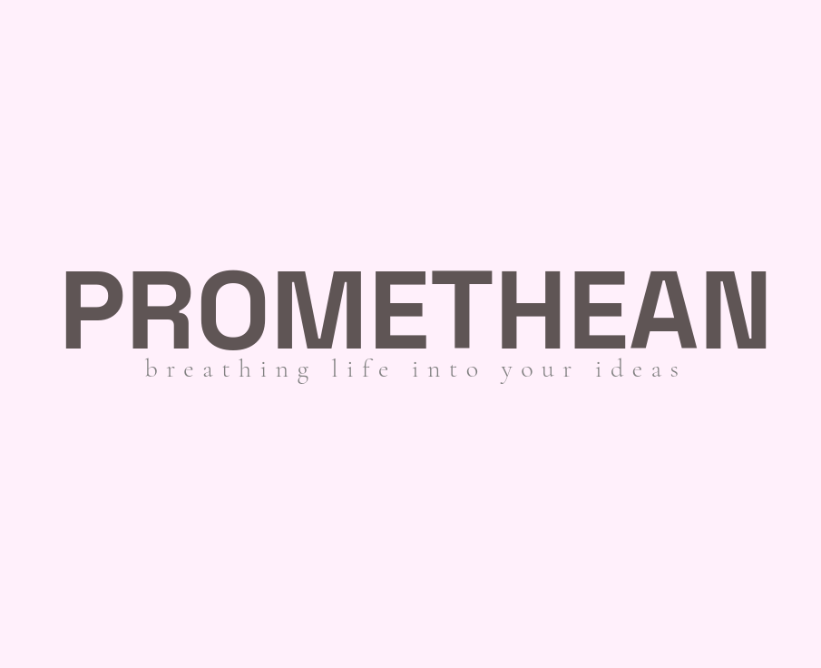

# Letter animation

Example on how to animate letters.



## Installation

Install dependencies:

```
npm install
```

Run code on a local server:
```
npm run dev
```
Build:
```
npm run build
```

# Refs:

* [gsap](https://github.com/greensock/GSAP)
* [Splitting.js](https://github.com/shshaw/Splitting)

Fonts:
* Space Grotesk.
* Cormorant Garamond.


